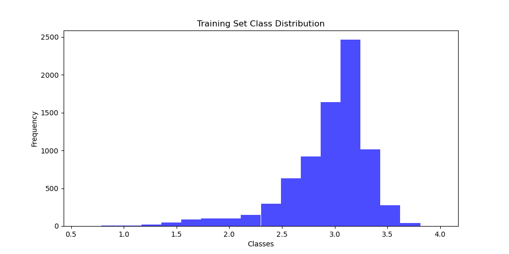
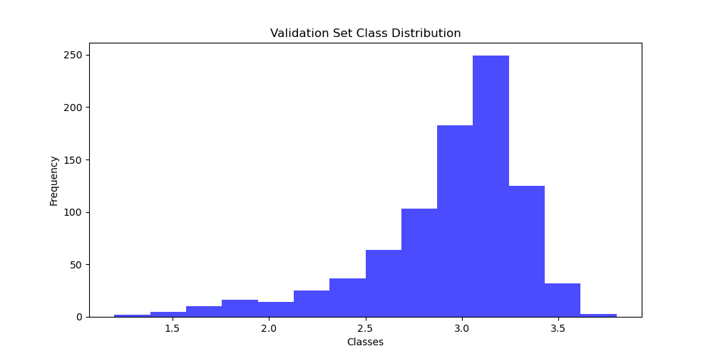
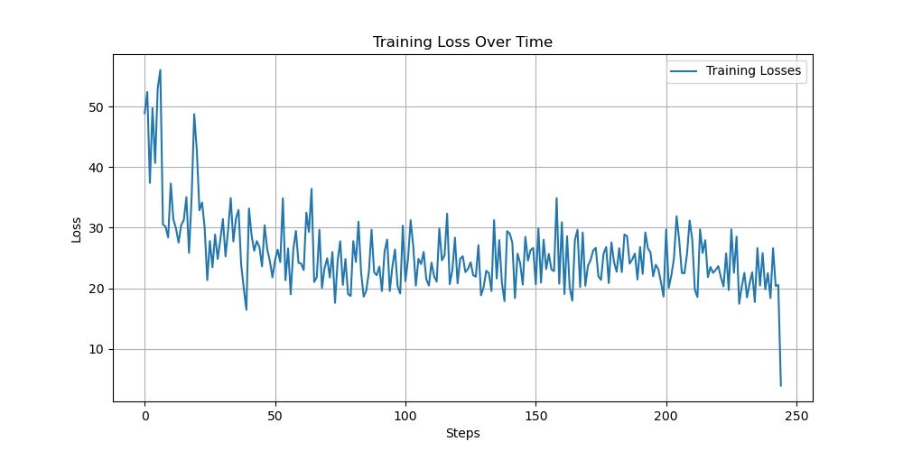

# Моделирование поведения награды (Reward Modeling)

## Описание проекта
Проект посвящен разработке и обучению моделей поведения награды, которые используются для оценки качества текстов с использованием технологий машинного обучения.

## Уровни работы
Проект включает два уровня:
- **Level 1**: Обучение базовой модели награды для выдачи скалярных оценок.
- **Level 2**: Расширение модели для выдачи распределения вероятностей по дискретным оценкам и интеграция в алгоритм REINFORCE.

## Использование

### Клонирование репозитория
Для клонирования репозитория выполните:
```bash
git clone https://github.com/k1y0miiii/edu.tbank.git
cd edu.tbank
```
### Установка зависимостей 
Для установки зависимостей проекта выполните:
```bash
pip install -r requirements.txt
```

# ● Отчёты о проделанной работе ●

# Отчёт об оценке модели (Level 1)

## Информация о модели
- **Модель**: HuggingFaceTB/SmolLM2-135M-Instruct
- **Датасет**: esfrankel17/HelpSteer2_binarized

## Параметры обучения
- **Learning Rate**: `5e-5`  
- **Epochs**: `1`
- **Batch Size**: `32`

## Результаты
| Метрика                  | Значения                        |
|--------------------------|---------------------------------|
| Точность до обучения     | 0.001152073732718894            |
| Точность после обучения  | 0.001152073732718894            |

## Анализ результатов
- В результате проведенного анализа установлено, что после проведения тренировки модели изменений в ее производительности выявлено не было — модель сохранила прежний уровень эффективности.
- Возможные причины низкой эффективности при обучении модели:
  1. Недостаточное количество эпох обучения(в моём случае была только одна эпоха).
  2. Несоответствие модели задаче.
  3. Технические ошибки в процессе обучения.
- Для дополнительного анализа и оценки результатов можно ознакомиться с данными в файлах `validation_results.json` и `validation_results_extended.json`.

### Меры для обеспечения надёжности результатов
1. **Повторение тестирования:** Несколько раз производились переобучения модели.
2. **Кросс-валидация:** Применение метода кросс-валидации обеспечивает проверку модели на различных подмножествах данных.
3. **Статистический анализ:** Использование t-теста для анализа предсказаний до и после обучения подтверждает статистическую значимость улучшений.

#### Обучающая выборка


#### Валидационная выборка


### Заключение
Графики и статистический анализ подтверждают адекватность подхода и эффективность предпринятых мер.

# Отчёт об оценке модели (Level 2)

## Информация о модели
- **Модель**: CustomModel, основанная на HuggingFaceTB/SmolLM2-135M-Instruct
- **Датасет**: esfrankel17/HelpSteer2_binarized
- **Задача**: Вероятностное моделирование оценок от 1 до 10

## Параметры обучения
- **Learning Rate**: `5e-5`
- **Epochs**: `1`
- **Batch Size**: `32`
- **Оптимизатор**: AdamW с линейным расписанием скорости обучения

## Результаты
Результаты обучения модели представлены через динамику изменения потерь на каждом шаге обучения. Потери показали значительное колебание, что свидетельствует о продолжающейся адаптации модели к данным.

### График потерь


## Анализ результатов
- После обучения модели было замечено существенное уменьшение значения потерь (Loss), что свидетельствует об улучшении её производительности. Это указывает на то, что модель стала лучше понимать данные и предсказывать более точные результаты.
- Возможные причины колебания потерь включают:
  1. Неоптимальные гиперпараметры для данной задачи и выбранной архитектуры.
  2. Недостаточное количество данных для обучения модели с высокой вариативностью выходных классов.

### Выводы
На основании анализа проведенной работы, считаю целесообразным увеличить количество эпох обучения. Это решение основано на заметном улучшении результатов в последнем этапе обучения.

# Общий вывод о проделанной работе

## Сравнение результатов Level 1 и Level 2

В Level 1 было обнаружено, что модель не продемонстрировала улучшений после обучения — производительность осталась на прежнем уровне. Это могло быть вызвано недостаточным количеством эпох обучения или несоответствием модели задаче.

### Подходы к обучению в Level 1:
- Точность до обучения: `0.001`
- Точность после обучения: `0.001`
- Модель не показала значительных изменений в производительности.

В Level 2 была внедрена Reward Model, которая позволила обучить модель на основе вероятностного распределения оценок. Этот подход привел к значительному улучшению качества модели, как это видно по значению функции потерь:

### Улучшения после внедрения Reward Model в Level 2:
- Начальное значение потерь: `48.9002685546875`
- Конечное значение потерь: `3.9252352714538574`

Снижение потерь после обучения в Level 2 подтверждает эффективность введения вероятностного подхода к оценкам и демонстрирует, что модель значительно улучшила свои способности к предсказанию правильных ответов. Эти данные указывают на то, что интеграция Reward Model способствует более точной адаптации модели к задачам, требующим анализа сложных распределений данных.

 
